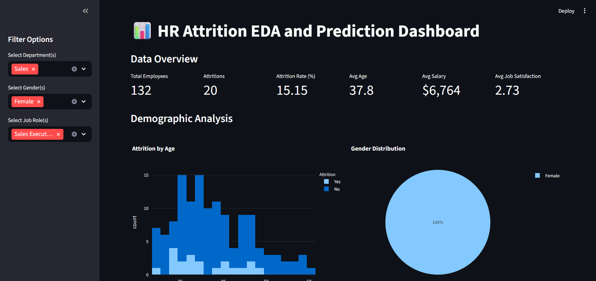

# Attrition_Analysis

“Understand why employees leave—before they actually do.”

A data-driven **HR analytics dashboard** that helps organizations visualize, understand, and predict employee attrition. Built with **Python, Streamlit, and Machine Learning**, it translates HR data into clear, actionable insights for better workforce retention.

---



## Overview

This project identifies patterns in employee turnover using **EDA (Exploratory Data Analysis)** and **predictive modeling**.
HR teams can explore:

* Who leaves (age, gender, role)
* Why they leave (satisfaction, salary, travel)
* When attrition spikes (tenure, department)
* Predict who might leave next

---

## Features

* **Interactive Dashboard** – Filter by department, gender, or role
* **Attrition Insights** – Analyze satisfaction, income, and performance
* **ML Predictions** – Forecast employee attrition risk
* **Visual Reports** – Bar, pie, and box plots for clarity
* **Excel Export** – Save insights for HR presentations

---

## Technology Stack

| Layer                | Tool/Library                |
| -------------------- | --------------------------- |
| **Frontend**         | Streamlit                   |
| **Data Handling**    | Pandas, NumPy               |
| **Visualization**    | Plotly, Seaborn, Matplotlib |
| **Machine Learning** | Scikit-learn                |
| **Data Export**      | Pandas ExcelWriter          |

---

## Getting Started

```bash
git clone https://github.com/yourusername/hr-attrition-dashboard.git
cd hr-attrition-dashboard
pip install -r requirements.txt
streamlit run app.py
```
